## PBPK Ontology

The PBPK (Physiologically-Based Pharmacokinetic) ontology is designed to support the modeling and understanding of pharmacokinetics in biological systems. This documentation provides an overview of the ontology development workflow, the imported ontologies, and the specific terms used in PBPK ontology.

NOTE: Detailed documentation of ontology can be found at this [link](https://insilicovida-research-lab.github.io/pbpko/)

#### Development Workflow

The development of the PBPK ontology leverages the ROBOT (ROBOT is an OBO Tool) framework, which provides powerful tools for ontology development, including ontology merging, reasoning, and template-based term generation.

#### Imported Ontologies

## Ontology Imports

1. [Basic Formal Ontology (BFO)](https://raw.githubusercontent.com/BFO-ontology/BFO/v2.0/bfo.owl)  
2. [Relation Ontology (RO)](https://raw.githubusercontent.com/oborel/obo-relations/v2024-04-24/ro.owl)  
3. [Gene Ontology (GO)](https://github.com/geneontology)  
4. [Ontology for Biomedical Investigations (OBI)](https://obi-ontology.org/)  
5. [Systems Biology Ontology](https://github.com/EBI-BioModels/SBO) 

### Integration with BFO

```mermaid
graph TB
    %% Legend at top
    subgraph Legend
        L_class((Class))
        L_sub1-.-L_sub2((Subclass Relation))
        L_obj1--"Object Property"-->L_obj2((Object Property))
    end

    %% BFO Core hierarchy on left
    subgraph BFO["BFO Core"]
        direction TB
        BFO_0000020((BFO:continuant))
        BFO_specifically_dependent((BFO:specifically dependent continuant))
        BFO_occurrent((BFO:occurrent))
        BFO_process((BFO:process))
        BFO_biological_process((BFO:biological process))
        
        %% BFO hierarchy
        BFO_0000020 -.- BFO_specifically_dependent
        BFO_occurrent -.- BFO_process
        BFO_process -.- BFO_biological_process
    end

    %% PBPKO organized by type
    subgraph PBPKO["PBPKO Components"]
        direction TB
        subgraph Parameters
            direction TB
            PBPKO_parameter((parameter))
            PBPKO_phys_param((physiological parameter))
            PBPKO_physchem_param((physicochemical parameter))
            PBPKO_biochem_param((biochemical parameter))
            PBPKO_route((route of exposure))
            
            %% Parameter hierarchy
            PBPKO_parameter -.- PBPKO_phys_param
            PBPKO_parameter -.- PBPKO_physchem_param
            PBPKO_parameter -.- PBPKO_biochem_param
            PBPKO_parameter -.- PBPKO_route
        end

        subgraph Core_Components["Core Components"]
            direction TB
            PBPKO_model((PBPK Model))
            PBPKO_enzyme((enzyme))
            PBPKO_compartment((compartment))
            PBPKO_transporter((transporter))
        end
        
        subgraph Biological_Processes["Biological Processes"]
            direction TB
            PBPKO_absorption((absorption))
            PBPKO_distribution((distribution))
            PBPKO_elimination((elimination))
            PBPKO_metabolism((metabolism))
            PBPKO_excretion((excretion))
            PBPKO_biliary((biliary elimination))
        end
    end

    %% BFO connections
    BFO_specifically_dependent -.- PBPKO_parameter
    BFO_specifically_dependent -.- PBPKO_model
    BFO_specifically_dependent -.- PBPKO_compartment
    BFO_0000020 -.- PBPKO_enzyme
    BFO_0000020 -.- PBPKO_transporter

    %% Process relationships
    BFO_biological_process -.- PBPKO_absorption
    BFO_biological_process -.- PBPKO_distribution
    BFO_biological_process -.- PBPKO_elimination
    BFO_biological_process -.- PBPKO_metabolism
    BFO_biological_process -.- PBPKO_excretion
    BFO_biological_process -.- PBPKO_biliary

    %% PBPK Model relationships
    PBPKO_model --"has_route_of_exposure"--> PBPKO_route
    PBPKO_model --"has_enzyme"--> PBPKO_enzyme
    PBPKO_model --"has_compartment"--> PBPKO_compartment
    PBPKO_model --"has_transporter"--> PBPKO_transporter
    PBPKO_model --"has_physiological_parameter"--> PBPKO_phys_param
    PBPKO_model --"has_physicochemical_parameter"--> PBPKO_physchem_param
    PBPKO_model --"has_biochemical_parameter"--> PBPKO_biochem_param
    PBPKO_model --"has_biological_process"--> PBPKO_absorption
    PBPKO_model --"has_biological_process"--> PBPKO_distribution
    PBPKO_model --"has_biological_process"--> PBPKO_elimination
    PBPKO_model --"has_biological_process"--> PBPKO_excretion
    PBPKO_model --"has_biological_process"--> PBPKO_biliary
```

#### PBPK terms vocabulary

PBPK terms are available in [ROBOT template](https://github.com/InSilicoVida-Research-Lab/pbpko/tree/main/Robot/templates)

#### Contributors for developing PBPKO
IISPV: Shubh Sharma, Deepika Deepika, Saurav Kumar, Vikas Kumar  
WUR: Johannes Kruisselbrink  
JSI: Panče Panov

#### Contact and Support

For questions or support regarding the PBPK ontology, please open an issue in the GitHub repository or contact the maintainers directly.

**Contact Person:** 
IISPV:
[Saurav Kumar](saurav.kumar@iispv.cat)
[Shubh Sharma](shubh.sharma@estudiants.urv.cat)
[Deepika Deepika](deepika@iispv.cat)
[Vikas Kumar](vikas.kumar@urv.cat)
