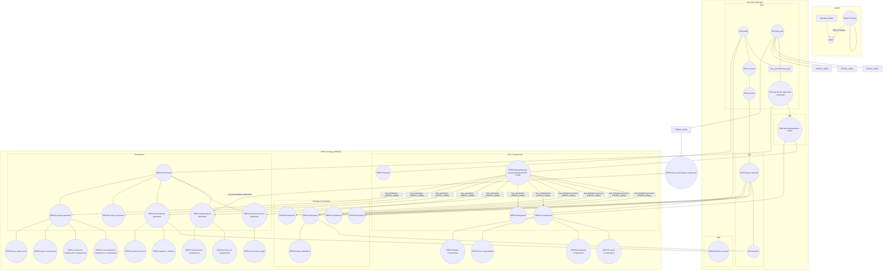

## PBPK Ontology

[](https://doi.org/10.5281/zenodo.18660038)

The PBPK (Physiologically-Based Pharmacokinetic) ontology is designed to support the modeling and understanding of pharmacokinetics in biological systems. This documentation provides an overview of the ontology development workflow, the imported ontologies, and the specific terms used in PBPK ontology.

Detailed documentation is available at [insilicovida-research-lab.github.io/pbpko](https://insilicovida-research-lab.github.io/pbpko/).

### Development Workflow

The development of the PBPK ontology leverages the [ROBOT](https://github.com/ontodev/robot) (ROBOT is an OBO Tool) framework, which provides powerful tools for ontology development, including ontology merging, reasoning, and template-based term generation.

PBPK terms are maintained in [ROBOT templates](https://github.com/InSilicoVida-Research-Lab/pbpko/tree/main/Robot/templates). See `Robot/command.txt` for the build commands used in this repository.

### Ontology Imports


1. [Basic Formal Ontology (BFO)](https://raw.githubusercontent.com/BFO-ontology/BFO/v2.0/bfo.owl)  
2. [Relation Ontology (RO)](https://raw.githubusercontent.com/oborel/obo-relations/v2024-04-24/ro.owl)  
3. [Gene Ontology (GO)](https://github.com/geneontology)  
4. [Ontology for Biomedical Investigations (OBI)](https://obi-ontology.org/)  
5. [Systems Biology Ontology](https://github.com/EBI-BioModels/SBO) 


### Integration with BFO

```mermaid
graph TB
    %% Legend
    subgraph Legend
        direction TB
        class_legend((Class))
        subclass_legend-.->class_legend
        property_legend---property_legend((Object Property))
        property_legend--"Object Property"-->class_legend
    end

    %% Ontology Imports (BFO, OBI, GO, SBO)
    subgraph Imported Ontologies
        direction LR
        subgraph BFO["BFO"]
            direction TB
            BFO_0000002((BFO:entity))
            BFO_0000020((BFO:continuant))
            BFO_0000051---BFO_0000020("has_part (BFO:has_part)")
            BFO_specifically_dependent((BFO:specifically dependent continuant))
            BFO_occurrent((BFO:occurrent))
            BFO_process((BFO:process))
        end

        subgraph OBI["OBI"]
            direction TB
            OBI_0000658((OBI:data representation model))
        end

        subgraph GO["GO"]
            direction TB
            GO_0008150((GO:biological process))
            GO_0007588((GO:excretion))
            GO_0008150---GO_0007588
        end
        
        subgraph SBO["SBO"]
            direction TB
            SBO_0000027((SBO:Michaelis constant))
        end

        %% Links between imported ontologies
        BFO_0000002---BFO_0000020
        BFO_0000020---BFO_specifically_dependent
        BFO_0000002---BFO_occurrent
        BFO_occurrent---BFO_process
        BFO_process---GO_0008150
        BFO_specifically_dependent---OBI_0000658
    end

    %% PBPKO Main Classes
    subgraph PBPKO["PBPK Ontology (PBPKO)"]
        direction TB
        subgraph Core_Components
            direction TB
            PBPKO_00003((PBPKO:physiologically based pharmacokinetic model))
            PBPKO_00446((PBPKO:compartment))
            PBPKO_00217((PBPKO:transporter))
            %% PBPKO_enzyme - derived from definitions/context
            PBPKO_enzyme((PBPKO:enzyme))
        end

        subgraph Biological_Processes
            direction TB
            PBPKO_00140((PBPKO:absorption))
            PBPKO_00146((PBPKO:distribution))
            %% Corrected parent based on definition
            PBPKO_00322((PBPKO:elimination))
            PBPKO_00188((PBPKO:metabolism))
            PBPKO_00238((PBPKO:biliary elimination))
        end

        subgraph Parameters
            direction TB
            PBPKO_00002((PBPKO:parameter))
            PBPKO_00006((PBPKO:physiological parameter))
            PBPKO_00126((PBPKO:physicochemical parameter))
            PBPKO_00139((PBPKO:biochemical parameter))
            PBPKO_00239((PBPKO:route of exposure))
            PBPKO_00252((PBPKO:output parameter))
        end

        %% PBPKO Hierarchy
        OBI_0000658---PBPKO_00003
        OBI_0000658---PBPKO_00446
        BFO_0000002---PBPKO_00217
        BFO_0000002---PBPKO_enzyme
        
        GO_0008150---PBPKO_00140
        GO_0008150---PBPKO_00146
        GO_0008150---PBPKO_00322
        GO_0008150---PBPKO_00188
        PBPKO_00322---GO_0007588
        PBPKO_00322---PBPKO_00238

        BFO_specifically_dependent---PBPKO_00002
        PBPKO_00002---PBPKO_00006
        PBPKO_00002---PBPKO_00126
        PBPKO_00002---PBPKO_00139
        PBPKO_00002---PBPKO_00239
        PBPKO_00002---PBPKO_00252

        PBPKO_00139---SBO_0000027

        %% Example Subclasses
        PBPKO_00006---PBPKO_vol((PBPKO:volume of compartment))
        PBPKO_00006---PBPKO_bf((PBPKO:blood flow to compartment))
        PBPKO_00139---PBPKO_pc((PBPKO:partition coefficient))
        PBPKO_00139---PBPKO_uf((PBPKO:unbound fraction))
        PBPKO_00126---PBPKO_mw((PBPKO:molecular weight))
        PBPKO_00446---PBPKO_central((PBPKO:central compartment))
        PBPKO_00446---PBPKO_peripheral((PBPKO:peripheral compartment))
        PBPKO_00446---PBPKO_liver_cpt((PBPKO:liver compartment))
        PBPKO_00446---PBPKO_kidney_cpt((PBPKO:kidney compartment))

        PBPKO_00252---PBPKO_conc_cpt((PBPKO:concentration of compound in compartment))
        PBPKO_00252---PBPKO_amount_cpt((PBPKO:amount of compound in compartment))

        PBPKO_00252---PBPKO_peak_conc((PBPKO:peak concentration))
        PBPKO_00252---PBPKO_auc((PBPKO:area under curve))
    end

    %% PBPKO Object Properties
    PBPKO_00003--"has_biological_process (PBPKO_10001)"-->PBPKO_00140
    PBPKO_00003--"has_biological_process (PBPKO_10001)"-->PBPKO_00146
    PBPKO_00003--"has_biological_process (PBPKO_10001)"-->PBPKO_00322
    PBPKO_00003--"has_biological_process (PBPKO_10001)"-->PBPKO_00188

    PBPKO_00003--"has_compartment (PBPKO_10002)"-->PBPKO_00446

    PBPKO_00003--"has_transporter (PBPKO_10004)"-->PBPKO_00217

    %% Using the general has_parameter property
    PBPKO_00003--"has_parameter (PBPKO_10005)"-->PBPKO_00006
    PBPKO_00003--"has_parameter (PBPKO_10005)"-->PBPKO_00126
    PBPKO_00003--"has_parameter (PBPKO_10005)"-->PBPKO_00139
    PBPKO_00003--"has_parameter (PBPKO_10005)"-->PBPKO_00239
    PBPKO_00003--"has_parameter (PBPKO_10005)"-->PBPKO_00252

    %% Example of object property subclass
    PBPKO_10005---PBPKO_10008((PBPKO:has_physiological_parameter))
    PBPKO_10008--"has_physiological_parameter"-->PBPKO_00006

    %% Link object properties to their domain
    BFO_0000051((BFO:has_part))

    %% Link PBPKO properties to their superproperty
    BFO_0000051---PBPKO_10001
    BFO_0000051---PBPKO_10002
    BFO_0000051---PBPKO_10004
    BFO_0000051---PBPKO_10005
```

### License

This project is licensed under [Creative Commons Attribution 4.0 International (CC BY 4.0)](LICENSE).

### Contributing

#### Commit message format

This repository enforces [Conventional Commits](https://www.conventionalcommits.org/) via Husky and commitlint.

Format: `<type>(<optional scope>): <description>`

Allowed types: `feat`, `fix`, `docs`, `style`, `refactor`, `perf`, `test`, `build`, `ci`, `chore`, `revert`

Examples:

- `feat: add clearance parameter terms`
- `fix: correct PBPKO_00387 definition`
- `docs: update README release instructions`
- `chore: update ROBOT templates`

For breaking changes, use `feat!:` or `fix!:` and include `BREAKING CHANGE:` in the commit body.

#### Local setup

```bash
npm install
```

Husky hooks are installed automatically via the `prepare` script and validate commit messages locally.

To propose ontology changes, open an issue using the templates in `.github/ISSUE_TEMPLATE/`.

### Releases

PBPKO follows [OBO Foundry versioning](https://obofoundry.org/principles/fp-004-versioning.html). Official releases are identified by **ISO dates** (`YYYY-MM-DD`), not semver.

| Resource | IRI / path |
|----------|------------|
| Latest ontology | `http://purl.obolibrary.org/obo/pbpko.owl` |
| Dated release | `http://purl.obolibrary.org/obo/pbpko/releases/YYYY-MM-DD/pbpko.owl` |
| Development copy | `Robot/ontologies/pbpko.owl` on `main` |
| Immutable snapshot | `releases/YYYY-MM-DD/pbpko.owl` |

Releases are automated with [semantic-release](https://semantic-release.gitbook.io/) when releasable commits are pushed to `main`. The release workflow sets the dated `owl:versionIRI`, updates `owl:versionInfo`, and publishes an immutable snapshot under `releases/YYYY-MM-DD/`.

| Commit type | Triggers release? |
|-------------|-------------------|
| `fix:` | Yes (patch bump) |
| `feat:` | Yes (minor bump) |
| `feat!:` / `fix!:` with `BREAKING CHANGE:` | Yes (major bump) |
| `chore:`, `docs:`, `ci:`, etc. | No |

GitHub releases are created automatically. Each release is archived on Zenodo when the [GitHub–Zenodo integration](https://help.zenodo.org/docs/github/) is enabled. Zenodo metadata is configured in [.zenodo.json](.zenodo.json).

PURL configuration for OBO is maintained in the [OBO Foundry PURL repository](https://github.com/OBOFoundry/purl.obolibrary.org). A draft for PBPKO is provided in [config/pbpko-purl.yml](config/pbpko-purl.yml).

### Changelog

See [CHANGELOG.md](CHANGELOG.md) for version history (dated OBO releases).

Add user-facing ontology changes under `[Unreleased]` in `CHANGELOG.md` as you work. When releasing, move them into a new `## [YYYY-MM-DD]` section matching the OBO release date.

### Citation

When citing this ontology, use the Zenodo DOI: [10.5281/zenodo.18660038](https://doi.org/10.5281/zenodo.18660038).

### Contributors
IISPV: Shubh Sharma, Deepika Deepika, Saurav Kumar, Vikas Kumar  
WUR: Johannes Kruisselbrink  
JSI: Panče Panov

### Contact and Support

For questions or support regarding the PBPK ontology, please open an issue in the GitHub repository or contact the maintainers directly.

**IISPV**

- [Saurav Kumar](mailto:saurav.kumar@iispv.cat)
- [Shubh Sharma](mailto:shubh.sharma@estudiants.urv.cat)
- [Deepika Deepika](mailto:deepika@iispv.cat)
- [Vikas Kumar](mailto:vikas.kumar@urv.cat)
