# PBPK Ontology (PBPKO)

The PBPK (Physiologically-Based Pharmacokinetic) ontology is designed to support the modeling and understanding of pharmacokinetics in biological systems. This documentation provides an overview of the ontology development workflow, the imported ontologies, and the specific terms used in PBPK ontology.

!!! note "Detailed Documentation"
    Detailed documentation of ontology can be found at this [link](https://insilicovida-research-lab.github.io/pbpko/)

## Development Workflow

The development of the PBPK ontology leverages the ROBOT (ROBOT is an OBO Tool) framework, which provides powerful tools for ontology development, including ontology merging, reasoning, and template-based term generation.

## Ontology Imports

The PBPKO ontology imports several foundational ontologies to ensure interoperability and adherence to ontological best practices:

1. **[Basic Formal Ontology (BFO)](https://raw.githubusercontent.com/BFO-ontology/BFO/v2.0/bfo.owl)**  
2. **[Relation Ontology (RO)](https://raw.githubusercontent.com/oborel/obo-relations/v2024-04-24/ro.owl)**  
3. **[Gene Ontology (GO)](https://github.com/geneontology)**  
4. **[Ontology for Biomedical Investigations (OBI)](https://obi-ontology.org/)**  
5. **[Systems Biology Ontology](https://github.com/EBI-BioModels/SBO)** 

### Integration with BFO

```mermaid
graph TB
    %% Legend
    subgraph Legend
        direction TB
        class_legend((Class))
        subclass_legend-.->class_legend
        property_legend---property_legend((Object Property))
        property_legend--"Object Property"-->class_legend
    end

    %% Ontology Imports (BFO, OBI, GO, SBO)
    subgraph Imported Ontologies
        direction LR
        subgraph BFO["BFO"]
            direction TB
            BFO_0000002((BFO:entity))
            BFO_0000020((BFO:continuant))
            BFO_0000051---BFO_0000020("has_part (BFO:has_part)")
            BFO_specifically_dependent((BFO:specifically dependent continuant))
            BFO_occurrent((BFO:occurrent))
            BFO_process((BFO:process))
        end

        subgraph OBI["OBI"]
            direction TB
            OBI_0000658((OBI:data representation model))
        end

        subgraph GO["GO"]
            direction TB
            GO_0008150((GO:biological process))
            GO_0007588((GO:excretion))
            GO_0008150---GO_0007588
        end
        
        subgraph SBO["SBO"]
            direction TB
            SBO_0000027((SBO:Michaelis constant))
        end

        %% Links between imported ontologies
        BFO_0000002---BFO_0000020
        BFO_0000020---BFO_specifically_dependent
        BFO_0000002---BFO_occurrent
        BFO_occurrent---BFO_process
        BFO_process---GO_0008150
        BFO_specifically_dependent---OBI_0000658
    end

    %% PBPKO Main Classes
    subgraph PBPKO["PBPK Ontology (PBPKO)"]
        direction TB
        subgraph Core_Components
            direction TB
            PBPKO_00003((PBPKO:physiologically based pharmacokinetic model))
            PBPKO_00446((PBPKO:compartment))
            PBPKO_00217((PBPKO:transporter))
            %% PBPKO_enzyme - derived from definitions/context
            PBPKO_enzyme((PBPKO:enzyme))
        end

        subgraph Biological_Processes
            direction TB
            PBPKO_00140((PBPKO:absorption))
            PBPKO_00146((PBPKO:distribution))
            %% Corrected parent based on definition
            PBPKO_00322((PBPKO:elimination))
            PBPKO_00188((PBPKO:metabolism))
            PBPKO_00238((PBPKO:biliary elimination))
        end

        subgraph Parameters
            direction TB
            PBPKO_00002((PBPKO:parameter))
            PBPKO_00006((PBPKO:physiological parameter))
            PBPKO_00126((PBPKO:physicochemical parameter))
            PBPKO_00139((PBPKO:biochemical parameter))
            PBPKO_00239((PBPKO:route of exposure))
            PBPKO_00252((PBPKO:output parameter))
        end

        %% PBPKO Hierarchy
        OBI_0000658---PBPKO_00003
        OBI_0000658---PBPKO_00446
        BFO_0000002---PBPKO_00217
        BFO_0000002---PBPKO_enzyme
        
        GO_0008150---PBPKO_00140
        GO_0008150---PBPKO_00146
        GO_0008150---PBPKO_00322
        GO_0008150---PBPKO_00188
        PBPKO_00322---GO_0007588
        PBPKO_00322---PBPKO_00238

        BFO_specifically_dependent---PBPKO_00002
        PBPKO_00002---PBPKO_00006
        PBPKO_00002---PBPKO_00126
        PBPKO_00002---PBPKO_00139
        PBPKO_00002---PBPKO_00239
        PBPKO_00002---PBPKO_00252

        PBPKO_00139---SBO_0000027

        %% Example Subclasses
        PBPKO_00006---PBPKO_vol((PBPKO:volume of compartment))
        PBPKO_00006---PBPKO_bf((PBPKO:blood flow to compartment))
        PBPKO_00139---PBPKO_pc((PBPKO:partition coefficient))
        PBPKO_00139---PBPKO_uf((PBPKO:unbound fraction))
        PBPKO_00126---PBPKO_mw((PBPKO:molecular weight))
        PBPKO_00446---PBPKO_central((PBPKO:central compartment))
        PBPKO_00446---PBPKO_peripheral((PBPKO:peripheral compartment))
        PBPKO_00446---PBPKO_liver_cpt((PBPKO:liver compartment))
        PBPKO_00446---PBPKO_kidney_cpt((PBPKO:kidney compartment))

        PBPKO_00252---PBPKO_conc_cpt((PBPKO:concentration of compound in compartment))
        PBPKO_00252---PBPKO_amount_cpt((PBPKO:amount of compound in compartment))

        PBPKO_00252---PBPKO_peak_conc((PBPKO:peak concentration))
        PBPKO_00252---PBPKO_auc((PBPKO:area under curve))
    end

    %% PBPKO Object Properties
    PBPKO_00003--"has_biological_process (PBPKO_10001)"-->PBPKO_00140
    PBPKO_00003--"has_biological_process (PBPKO_10001)"-->PBPKO_00146
    PBPKO_00003--"has_biological_process (PBPKO_10001)"-->PBPKO_00322
    PBPKO_00003--"has_biological_process (PBPKO_10001)"-->PBPKO_00188

    PBPKO_00003--"has_compartment (PBPKO_10002)"-->PBPKO_00446

    PBPKO_00003--"has_transporter (PBPKO_10004)"-->PBPKO_00217

    %% Using the general has_parameter property
    PBPKO_00003--"has_parameter (PBPKO_10005)"-->PBPKO_00006
    PBPKO_00003--"has_parameter (PBPKO_10005)"-->PBPKO_00126
    PBPKO_00003--"has_parameter (PBPKO_10005)"-->PBPKO_00139
    PBPKO_00003--"has_parameter (PBPKO_10005)"-->PBPKO_00239
    PBPKO_00003--"has_parameter (PBPKO_10005)"-->PBPKO_00252

    %% Example of object property subclass
    PBPKO_10005---PBPKO_10008((PBPKO:has_physiological_parameter))
    PBPKO_10008--"has_physiological_parameter"-->PBPKO_00006

    %% Link object properties to their domain
    BFO_0000051((BFO:has_part))

    %% Link PBPKO properties to their superproperty
    BFO_0000051---PBPKO_10001
    BFO_0000051---PBPKO_10002
    BFO_0000051---PBPKO_10004
    BFO_0000051---PBPKO_10005
```

## PBPK Terms Vocabulary

PBPK terms are available in [ROBOT template](https://github.com/InSilicoVida-Research-Lab/pbpko/tree/main/Robot/templates)

## Quick Navigation

- **[About PBPKO](about.md)** - Learn more about the ontology
- **[Browse Ontology](core_classes.md)** - Explore the ontology structure
- **[Download](current_release.md)** - Get the latest release
- **[Contribute](contributing.md)** - Help improve the ontology
