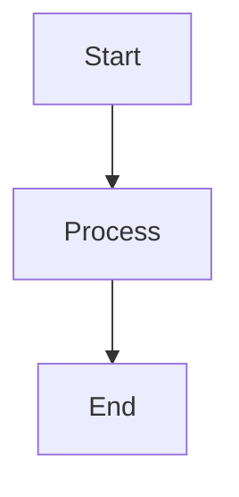
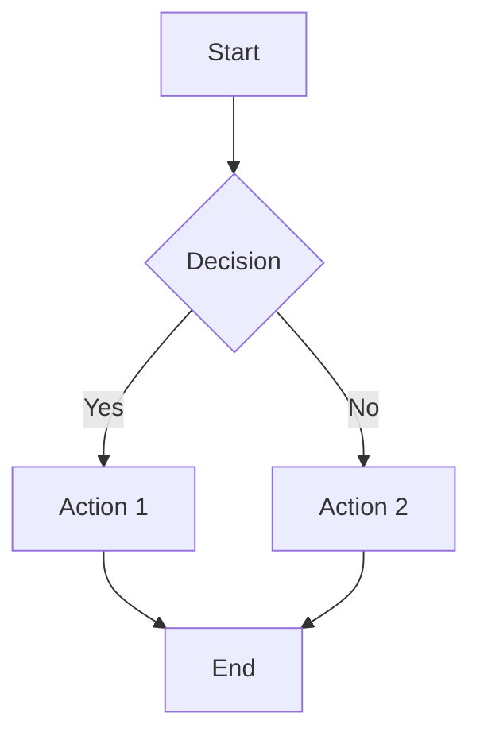

# Managing the Documentation

This guide explains how to manage and maintain the PBPKO documentation using MkDocs.

## Documentation Structure

### File Organization

```
docs/
├── index.md                 # Home page
├── about.md                 # About PBPKO
├── team.md                  # Team information
├── contributing.md          # Contribution guide
├── robot_templates.md      # ROBOT templates guide
├── build_process.md         # Build process
├── manage_documentation.md  # This file
├── continuous_integration.md
├── manage_automated_tests.md
├── pbpko_release.md
├── pbpko_editor_sop.md
├── onboarding.md
├── id_management.md
├── publications.md
├── related_resources.md
├── user_documentation.md
├── editors_documentation.md
├── design_patterns.md
└── pbpko_build_pipeline.md
```

### MkDocs Configuration

**mkdocs.yml** contains:
- Site configuration
- Navigation structure
- Theme settings
- Plugin configuration

## Adding New Pages

### 1. Create the File

Create a new `.md` file in the `docs/` directory:

```bash
touch docs/new_page.md
```

### 2. Add Navigation

Update `mkdocs.yml` to include the new page:

```yaml
nav:
  - Section Name:
      - New Page: new_page.md
```

### 3. Write Content

Use Markdown syntax with MkDocs extensions:

```markdown
# Page Title

## Section

Content here...

!!! note "Note"
    Important information


```

## Content Guidelines

### Writing Style

- **Clear and concise** - Avoid jargon when possible
- **Consistent tone** - Professional but approachable
- **Structured** - Use headings and lists effectively
- **Examples** - Include practical examples

### Markdown Features

**Admonitions:**
```markdown
!!! note "Note"
    Important information

!!! warning "Warning"
    Be careful

!!! tip "Tip"
    Helpful suggestion
```

**Code blocks:**
```markdown
```bash
robot template --template Robot/templates/vocab.tsv
```
```

**Tables:**
```markdown
| Column 1 | Column 2 |
|----------|----------|
| Data 1   | Data 2   |
```

**Links:**
```markdown
[Link text](url)
[Internal link](other_page.md)
```

## Mermaid Diagrams

### Supported Diagram Types

- **Flowcharts** - Process flows
- **Sequence diagrams** - Interactions
- **Class diagrams** - Ontology structure
- **Git graphs** - Version control

### Example Usage

```markdown

```

## Local Development

### Setup

1. **Install MkDocs:**
   ```bash
   pip install mkdocs mkdocs-material
   ```

2. **Install plugins:**
   ```bash
   pip install pymdown-extensions
   ```

### Preview Changes

**Start development server:**
```bash
mkdocs serve
```

**View at:** http://127.0.0.1:8000

**Auto-reload:** Changes automatically refresh

### Build Site

**Build static site:**
```bash
mkdocs build
```

**Output:** `site/` directory

## Deployment

### GitHub Pages

**Deploy to GitHub Pages:**
```bash
mkdocs gh-deploy
```

**Automatic deployment** with GitHub Actions:

```yaml
name: Deploy Docs
on:
  push:
    branches: [ main ]
jobs:
  deploy:
    runs-on: ubuntu-latest
    steps:
      - uses: actions/checkout@v2
      - name: Setup Python
        uses: actions/setup-python@v2
        with:
          python-version: 3.x
      - name: Install dependencies
        run: pip install mkdocs mkdocs-material
      - name: Deploy
        run: mkdocs gh-deploy --force
```

## Content Management

### Regular Updates

- **Keep information current** - Update outdated content
- **Add new features** - Document new functionality
- **Improve clarity** - Refine existing content
- **Fix errors** - Correct mistakes and typos

### Version Control

- **Commit frequently** - Small, focused commits
- **Use descriptive messages** - Clear commit descriptions
- **Review changes** - Check content before merging

### Collaboration

- **Use pull requests** - For documentation changes
- **Request reviews** - Get feedback from team
- **Discuss changes** - Use GitHub issues for planning

## Quality Assurance

### Content Review

- **Accuracy** - Verify technical accuracy
- **Completeness** - Ensure all necessary information
- **Clarity** - Check for clear explanations
- **Consistency** - Maintain style and format

### Technical Checks

- **Link validation** - Check all links work
- **Image optimization** - Compress images
- **Mobile responsiveness** - Test on mobile devices
- **Accessibility** - Ensure accessibility standards

## Maintenance Tasks

### Monthly

- [ ] Review and update content
- [ ] Check for broken links
- [ ] Update version information
- [ ] Review user feedback

### Quarterly

- [ ] Major content reorganization
- [ ] Update navigation structure
- [ ] Review and update guidelines
- [ ] Performance optimization

### Annually

- [ ] Complete documentation audit
- [ ] Update technology stack
- [ ] Review and update policies
- [ ] Plan major improvements

## Troubleshooting

### Common Issues

**Build errors:**
- Check YAML syntax in mkdocs.yml
- Verify file paths
- Check Markdown syntax

**Deployment issues:**
- Verify GitHub Pages settings
- Check repository permissions
- Review deployment logs

**Content issues:**
- Validate Markdown syntax
- Check image paths
- Verify link URLs

### Getting Help

- Check MkDocs documentation
- Review GitHub issues
- Contact maintainers
- Ask community for help

## Resources

- [MkDocs Documentation](https://www.mkdocs.org/)
- [Material for MkDocs](https://squidfunk.github.io/mkdocs-material/)
- [Markdown Guide](https://www.markdownguide.org/)
- [Mermaid Documentation](https://mermaid-js.github.io/mermaid/)
