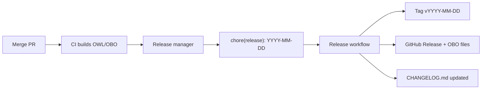

# The release workflow

PBPKO uses an **automated release pipeline** based on GitHub Actions, Conventional Commits,
and date-based versioning (`vYYYY-MM-DD`), following OBO Foundry practice.

## Overview

1. Develop and merge ontology changes (Conventional Commits).
2. CI builds and commits release artefacts (`pbpko.owl`, `pbpko.obo`, etc.) on every push.
3. Release manager pushes a release commit → automated GitHub Release with OBO assets.



## Preparation

1. Ensure all pull requests are merged into `main` (or the release branch).
2. Wait for [CI](../.github/workflows/qc.yml) to finish and commit fresh release artefacts.
3. Optionally review `pbpko.obo` and `pbpko-base.owl` in the latest commit.

## Trigger an automated release

From the branch you want to release (typically `main`):

```bash
git pull
git commit --allow-empty -m "chore(release): 2026-07-10"
git push origin main
```

Replace `2026-07-10` with the intended release date. This date becomes:

- Git tag: `v2026-07-10`
- ODK `owl:versionInfo` and OBO `data-version:` in release files
- GitHub Release title: `2026-07-10 Release`

The [Release workflow](../.github/workflows/release.yml) will:

1. Run `make VERSION=YYYY-MM-DD prepare_release_fast`
2. Generate a ROBOT diff against the previous tag (`src/ontology/reports/release-diff.md`)
3. Update [`CHANGELOG.md`](../CHANGELOG.md) from conventional commits since the last tag
4. Commit release artefacts with `[skip ci]`
5. Create tag `vYYYY-MM-DD` and a GitHub Release attaching:
   - `pbpko.owl`, `pbpko.obo`
   - `pbpko-base.owl`, `pbpko-base.obo`
   - `pbpko-full.owl`, `pbpko-full.obo`
   - Root `imports/*.owl` and `mappings/pbpko-sssom.sssom.tsv`

## Review the release

1. Open the new [GitHub Release](https://github.com/InSilicoVida-Research-Lab/pbpko/releases).
2. Review release notes (from `CHANGELOG.md`) and the attached `pbpko.obo`.
3. For a detailed ontology diff, see `src/ontology/reports/release-diff.md` in the repo.

Recommended checks (from ODK best practice):

1. **`pbpko.obo`** — easy-to-review subset in OBO format.
2. **`pbpko-base.owl`** — asserted axioms you edited.
3. **`pbpko-full.owl`** — may show new inferences (diff can be large).

## Local release (optional)

To build release files locally without publishing:

```bash
cd src/ontology
docker pull obolibrary/odkfull:v1.6
docker run --rm -v "$(pwd)/../..:/work" -w /work/src/ontology \
  -e ROBOT_JAVA_ARGS=-Xmx6G obolibrary/odkfull:v1.6 \
  make prepare_release_fast -B
```

Release files are copied to the repository root.

## Versioning

| Scheme | Example | Status |
|--------|---------|--------|
| Date-based (OBO) | `v2026-07-10` | **Current** — used for new releases |
| Semver | `v1.4.0` | Legacy — historical releases only |

## Debugging typical ontology release problems

### Problems with memory

When you are dealing with large ontologies, you need a lot of memory. When you see error messages relating to large ontologies such as CHEBI, PRO, NCBITAXON, or Uberon, you should think of memory first, see [here](https://github.com/INCATools/ontology-development-kit/blob/master/docs/DealWithLargeOntologies.md).

### Problems when using OBO format based tools

Sometimes you will get cryptic error messages when using legacy tools using OBO format, such as the ontology release tool (OORT), which is also available as part of the ODK docker container. In these cases, you need to track down what axiom or annotation actually caused the breakdown. In our experience (in about 60% of the cases) the problem lies with duplicate annotations (`def`, `comment`) which are illegal in OBO. Here is an example recipe of how to deal with such a problem:

1. If you get a message like `make: *** [cl.Makefile:84: oort] Error 255` you might have a OORT error.
2. To debug this, in your terminal enter `sh run.sh make IMP=false PAT=false oort -B` (assuming you are already in the ontology folder in your directory)
3. This should show you where the error is in the log (eg multiple different definitions)
WARNING: THE FIX BELOW IS NOT IDEAL, YOU SHOULD ALWAYS TRY TO FIX UPSTREAM IF POSSIBLE
4. Open `pbpko-edit.owl` in Protégé and find the offending term and delete all offending issue (e.g. delete ALL definition, if the problem was "multiple def tags not allowed") and save.
*While this is not idea, as it will remove all definitions from that term, it will be added back again when the term is fixed in the ontology it was imported from and added back in.
5. Rerun `sh run.sh make IMP=false PAT=false oort -B` and if it all passes, commit your changes to a branch and make a pull request as usual.
