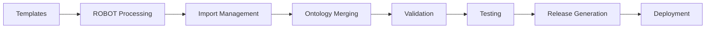

# PBPKO Build Pipeline

This page describes the complete build pipeline for PBPKO, including all steps from template processing to release generation.

## Pipeline Overview

The PBPKO build pipeline consists of several interconnected stages:



## Stage 1: Template Processing

### Input Sources

**Template Files:**
- `Robot/templates/vocab.tsv` - Main vocabulary
- `Robot/templates/properties.tsv` - Object properties
- `Robot/templates/input.tsv` - Additional input

**Configuration:**
- Template validation rules
- Column mapping definitions
- Processing parameters

### Processing Steps

**1. Template Validation:**
```bash
robot template --template Robot/templates/vocab.tsv --check
robot template --template Robot/templates/properties.tsv --check
```

**2. Ontology Generation:**
```bash
robot template --template Robot/templates/vocab.tsv \
               --template Robot/templates/properties.tsv \
               --output Robot/ontologies/edit.owl
```

**3. Quality Checks:**
- Column completeness validation
- ID uniqueness checking
- Reference validation
- Format compliance

## Stage 2: Import Management

### Import Sources

**Foundational Ontologies:**
- BFO (Basic Formal Ontology)
- RO (Relation Ontology)
- GO (Gene Ontology)
- OBI (Ontology for Biomedical Investigations)
- SBO (Systems Biology Ontology)

### Import Processing

**1. Extract Required Terms:**
```bash
robot extract --input Robot/ontologies/imported_modules.owl \
              --term-file Robot/extracted_terms/imported_modules/go_terms.txt \
              --output Robot/ontologies/go_module.owl
```

**2. Update Import Modules:**
```bash
robot merge --input Robot/ontologies/go_module.owl \
           --input Robot/ontologies/iao_module.owl \
           --input Robot/ontologies/obcs_module.owl \
           --input Robot/ontologies/uberon_module.owl \
           --output Robot/ontologies/imported_modules.owl
```

**3. Import Validation:**
- Check import completeness
- Validate import relationships
- Ensure consistency
- Update catalog files

## Stage 3: Ontology Merging

### Merge Process

**1. Merge Edit with Imports:**
```bash
robot merge --input Robot/ontologies/edit.owl \
           --input Robot/ontologies/imported_modules.owl \
           --output Robot/ontologies/pbpko.owl
```

**2. Post-Merge Processing:**
- Add annotations
- Update metadata
- Generate reports
- Validate consistency

### Merge Validation

**Consistency Checks:**
- Logical consistency
- Relationship validation
- Class hierarchy verification
- Property restrictions

## Stage 4: Validation

### Validation Levels

**1. Syntax Validation:**
```bash
robot validate --input Robot/ontologies/pbpko.owl
```

**2. Logical Consistency:**
```bash
robot reason --input Robot/ontologies/pbpko.owl --reasoner hermit
```

**3. Profile Validation:**
```bash
robot validate --input Robot/ontologies/pbpko.owl --profile profile.txt
```

### Validation Reports

**Report Generation:**
```bash
robot report --input Robot/ontologies/pbpko.owl \
             --output reports/pbpko-report.html
```

**Report Contents:**
- Validation results
- Error summaries
- Warning details
- Recommendations

## Stage 5: Testing

### Test Categories

**1. Unit Tests:**
- Individual component testing
- Template validation
- Import testing
- Property testing

**2. Integration Tests:**
- End-to-end build testing
- Cross-component validation
- Performance testing
- Regression testing

**3. Quality Tests:**
- Ontology quality metrics
- Coverage analysis
- Consistency checking
- Usability testing

### Test Execution

**Automated Testing:**
```bash
./scripts/run-tests.sh
```

**Test Reporting:**
```bash
robot test --input Robot/ontologies/pbpko.owl \
           --output reports/test-report.html
```

## Stage 6: Release Generation

### Release Preparation

**1. Version Management:**
- Update version numbers
- Generate release notes
- Update documentation
- Tag repository

**2. Release File Generation:**
```bash
# OWL format
robot convert --input Robot/ontologies/pbpko.owl \
              --format owl \
              --output releases/pbpko.owl

# OBO format
robot convert --input Robot/ontologies/pbpko.owl \
              --format obo \
              --output releases/pbpko.obo

# JSON-LD format
robot convert --input Robot/ontologies/pbpko.owl \
              --format json \
              --output releases/pbpko.json
```

### Release Validation

**Release Checks:**
- File integrity validation
- Format compliance
- Size optimization
- Metadata verification

## Stage 7: Deployment

### Documentation Deployment

**MkDocs Build:**
```bash
mkdocs build
```

**GitHub Pages Deployment:**
```bash
mkdocs gh-deploy
```

### Release Deployment

**GitHub Release:**
- Upload release files
- Generate release notes
- Tag repository
- Notify community

## Pipeline Automation

### GitHub Actions

**Build Workflow:**
```yaml
name: Build Pipeline
on: [push, pull_request]
jobs:
  build:
    runs-on: ubuntu-latest
    steps:
      - uses: actions/checkout@v2
      - name: Setup Java
        uses: actions/setup-java@v2
        with:
          java-version: '11'
      - name: Download ROBOT
        run: wget https://github.com/ontodev/robot/releases/download/v1.8.1/robot.jar
      - name: Run Pipeline
        run: ./scripts/pipeline.sh
```

### Local Execution

**Complete Pipeline:**
```bash
./scripts/pipeline.sh
```

**Individual Stages:**
```bash
./scripts/stage1-templates.sh
./scripts/stage2-imports.sh
./scripts/stage3-merge.sh
./scripts/stage4-validate.sh
./scripts/stage5-test.sh
./scripts/stage6-release.sh
./scripts/stage7-deploy.sh
```

## Pipeline Monitoring

### Metrics Tracking

**Build Metrics:**
- Execution time per stage
- Success/failure rates
- Resource usage
- Performance trends

**Quality Metrics:**
- Validation results
- Test coverage
- Error rates
- User feedback

### Alerting

**Failure Alerts:**
- Email notifications
- Slack integration
- GitHub issue creation
- Status page updates

## Pipeline Maintenance

### Regular Updates

**Dependency Updates:**
- ROBOT version updates
- Import ontology updates
- Tool version updates
- Security patches

**Process Improvements:**
- Pipeline optimization
- Error handling improvements
- Performance enhancements
- Feature additions

### Documentation

**Pipeline Documentation:**
- Process descriptions
- Configuration guides
- Troubleshooting information
- Best practices

## Troubleshooting

### Common Issues

**Build Failures:**
- Template format errors
- Import resolution issues
- Validation failures
- Resource constraints

**Performance Issues:**
- Long execution times
- Memory usage problems
- Network timeouts
- Storage limitations

### Debug Procedures

**Debug Mode:**
```bash
./scripts/pipeline.sh --debug
```

**Verbose Output:**
```bash
robot --verbose template --template Robot/templates/vocab.tsv
```

**Stage Isolation:**
```bash
./scripts/stage1-templates.sh --isolate
```

## Best Practices

### Pipeline Design

**Design Principles:**
- Modular architecture
- Clear stage separation
- Comprehensive validation
- Robust error handling

**Implementation Guidelines:**
- Use version control
- Maintain documentation
- Regular testing
- Community feedback

### Quality Assurance

**Quality Measures:**
- Automated validation
- Comprehensive testing
- Regular reviews
- Continuous improvement

## Resources

### Documentation

- [Build Process](build_process.md) - Detailed build procedures
- [ROBOT Templates](robot_templates.md) - Template usage
- [Continuous Integration](continuous_integration.md) - CI/CD setup
- [Quality Assurance](manage_automated_tests.md) - Testing procedures

### Tools

- [ROBOT](http://robot.obolibrary.org/) - Ontology development
- [GitHub Actions](https://github.com/features/actions) - CI/CD platform
- [MkDocs](https://www.mkdocs.org/) - Documentation generation
- [OWL](https://www.w3.org/OWL/) - Web Ontology Language

### Examples

- [PBPKO Pipeline](https://github.com/InSilicoVida-Research-Lab/pbpko/tree/main/scripts)
- [Build Scripts](https://github.com/InSilicoVida-Research-Lab/pbpko/tree/main/scripts)
- [Configuration Files](https://github.com/InSilicoVida-Research-Lab/pbpko/tree/main)
- [Release Files](https://github.com/InSilicoVida-Research-Lab/pbpko/releases)
