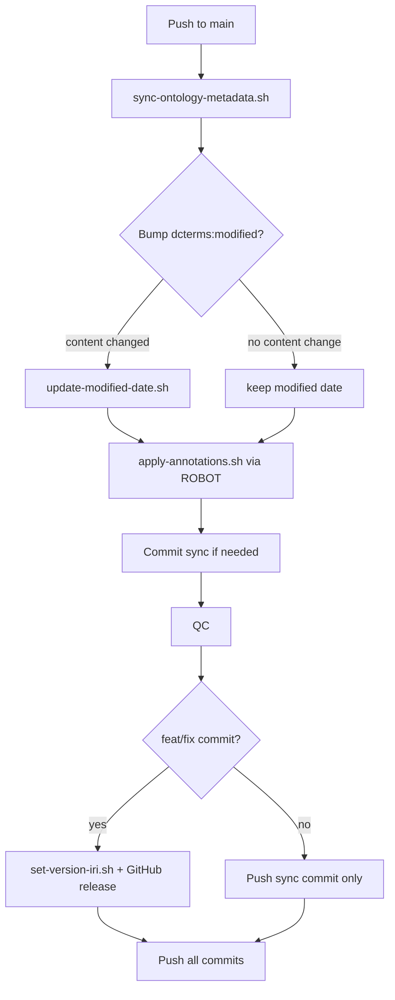

# PBPKO release and annotation workflow

This document describes how ontology metadata is managed, why `dcterms:modified` is
separate from the release date, and how `Robot/annotations/annotation.ttl` integrates
with ROBOT and semantic-release.

## Problem statement

Reviewers identified inconsistent metadata in past releases (e.g. tag `v1.3.2` with
`owl:versionInfo` `1.3.0` and `dcterms:modified` `2025-09-12`). Root causes:

1. Ontology files were uploaded manually without updating header fields.
2. `sed` patches in the release script mixed release metadata with content metadata.
3. `dcterms:modified` was set to the release date even when the release was a
   workflow-only change (`chore:`) with no term edits.

## Design principles

| Field | Meaning | When it changes |
|-------|---------|-----------------|
| `owl:versionIRI` | Immutable IRI for this release snapshot | Every official release |
| `owl:versionInfo` | Human-readable release identifier (ISO date) | Every official release |
| `dcterms:created` | Date the ontology was first published | Never (static in `annotation.ttl`) |
| `dcterms:modified` | Date ontology **content** last changed | When terms, axioms, or definitions change |
| `dcterms:title`, `description`, `license`, `creator`, `rdfs:label` | Descriptive metadata | Rarely; edited in `annotation.ttl` |

**Key rule:** a release can happen without a content change (e.g. after fixing CI).
`dcterms:modified` must **not** advance on such releases.

## Single source of truth: `annotation.ttl`

`Robot/annotations/annotation.ttl` holds all **stable** ontology annotations:

- Ontology subject IRI: `http://purl.obolibrary.org/obo/pbpko.owl`
- `dcterms:created`, `dcterms:modified`, creators, title, description, license, label
- Does **not** include `owl:versionInfo` (set per release by the release script)

ROBOT merges this file into the OWL header via `robot annotate --annotation-file`.
Stale header annotations are cleared first with `--remove-annotations` so values are
replaced rather than duplicated.

## Scripts

### `scripts/sync-ontology-metadata.sh`

Called automatically by the Release workflow on every push to `main`. Detects ontology
content changes, updates `dcterms:modified` when needed, and merges `annotation.ttl`.
Use `--check` on pull requests to verify metadata is in sync.

### `scripts/set-version-iri.sh`

Called automatically by semantic-release on `feat:` / `fix:` releases:

1. Sets `owl:versionIRI` to `.../releases/YYYY-MM-DD/pbpko.owl`
2. Sets `owl:versionInfo` to `YYYY-MM-DD` via ROBOT `--annotation`
3. Merges `annotation.ttl` (preserving `dcterms:modified` from that file)
4. Copies snapshot to `releases/YYYY-MM-DD/pbpko.owl`
5. Writes `pbpko-release.owl` for GitHub release asset upload

Does **not** update `dcterms:modified`.

## Contributor workflow

When changing ontology terms, edit `Robot/ontologies/pbpko.owl` (or rebuild it from
templates) and push to `main`. The Release workflow automatically:

1. Detects ontology content changes and sets `dcterms:modified` in `annotation.ttl`
2. Merges `annotation.ttl` into the OWL header via ROBOT
3. Runs QC and semantic-release when applicable

Pull requests run the same sync as a **check** (`--check`); if metadata is out of
sync, CI reports it and merge to `main` applies the sync automatically.

When changing only descriptive metadata (title, creators, license text):

```bash
# Edit Robot/annotations/annotation.ttl, then push to main (auto-synced)
```

Manual scripts remain available for local use:

```bash
bash scripts/sync-ontology-metadata.sh
bash scripts/update-modified-date.sh
bash scripts/apply-annotations.sh
```

## Release workflow (automated on push to main)



`chore:`, `docs:`, `ci:` commits do **not** trigger a release.

## QC checks

`Robot/sparql/ontology-metadata-violation.sparql` verifies:

- `owl:versionIRI` date matches `owl:versionInfo`
- `dcterms:modified` is present and parseable as `xsd:date`
- `dcterms:modified` is not after the release date in `versionInfo`

## GitHub release assets

| File | Purpose |
|------|---------|
| `releases/YYYY-MM-DD/pbpko.owl` | Immutable OBO snapshot (committed, PURL target) |
| `pbpko-release.owl` | Ephemeral copy attached to GitHub release (not committed) |

Asset label: `pbpko.owl` (canonical name; date is in tag and `versionInfo`).

## OBO Foundry / OLS

After each release:

1. Add `exact` PURL entry for the new date in [OBOFoundry/purl.obolibrary.org](https://github.com/OBOFoundry/purl.obolibrary.org).
2. Point `products.pbpko.owl` to the latest dated release (not `main` dev copy).
3. Request OLS re-index once PURLs resolve.

See [obo-versioning-checklist.md](obo-versioning-checklist.md).

## Manuscript / citation guidance

Cite the **dated release IRI**, not semver tags:

```
http://purl.obolibrary.org/obo/pbpko/releases/2026-02-16/pbpko.owl
```

Zenodo DOI: [10.5281/zenodo.18660038](https://doi.org/10.5281/zenodo.18660038)

## Migration notes (historical semver releases)

Old tags (`v1.3.0`–`v1.3.2`) used semver in `versionInfo` and stale `modified` dates.
Dated snapshots under `releases/` backfill the correct OBO metadata. Semver tags remain
for git history only; **do not cite them** in publications.
