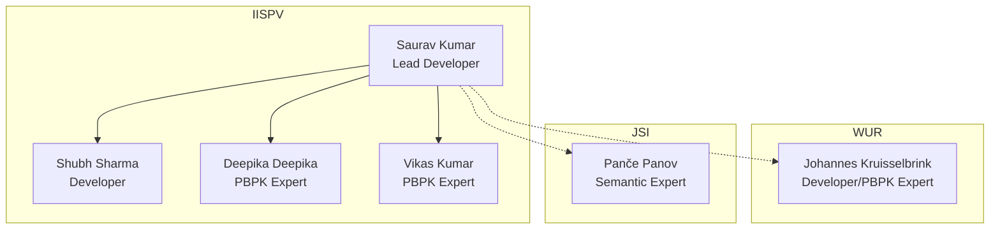

# The PBPKO Team

## Team Structure

The PBPKO team is organized across multiple institutions with clear roles and responsibilities:

## Core Development Team

### IISPV (Institut d'Investigació Sanitària Pere Virgili)

| Name | Title | Email | Role |
| --- | --- | --- | --- |
| Saurav Kumar | Developer | [saurav.kumar@iispv.cat](mailto:saurav.kumar@iispv.cat) | Ontology development, coordination, and maintenance |
| Shubh Sharma | Developer | [shubh.sharma@estudiants.urv.cat](mailto:shubh.sharma@estudiants.urv.cat) | Term development and ontology modeling |
| Deepika Deepika | PBPK Expert | [deepika@iispv.cat](mailto:deepika@iispv.cat) | Content curation and validation |
| Vikas Kumar | PBPK Expert | [vikas.kumar@urv.cat](mailto:vikas.kumar@urv.cat) | Ontology design and implementation |

### WUR (Wageningen University & Research)

| Name | Title | Email | Role |
| --- | --- | --- | --- |
| Johannes Kruisselbrink | Developer/PBPK expert |johannes.kruisselbrink@wur.nl  | Domain expertise and validation |

### JSI (Jožef Stefan Institute)

| Name | Title | Email | Role |
| --- | --- | --- | --- |
| Panče Panov | Semantic Expert | pance.panov@ijs.si | Ontology design and validation |

## Contributing

We welcome contributions from the PBPK modeling community! If you're interested in contributing to PBPKO, please:

1. Check our [Contributing Guidelines](contributing.md)
2. Open an issue on our [GitHub repository](https://github.com/InSilicoVida-Research-Lab/pbpko/issues)
3. Contact the maintainers directly

## Contact Information

For general inquiries about PBPKO, please contact:

**Primary Contact:** Saurav Kumar  
*Email:* [saurav.kumar@iispv.cat](mailto:saurav.kumar@iispv.cat)

**GitHub Repository:** [https://github.com/InSilicoVida-Research-Lab/pbpko](https://github.com/InSilicoVida-Research-Lab/pbpko)

**Issue Tracker:** [https://github.com/InSilicoVida-Research-Lab/pbpko/issues](https://github.com/InSilicoVida-Research-Lab/pbpko/issues)

## Acknowledgments

We acknowledge the contributions of the broader PBPK modeling community, the OBO Foundry community, and the developers of the foundational ontologies that PBPKO imports (BFO, RO, GO, OBI, and SBO).
